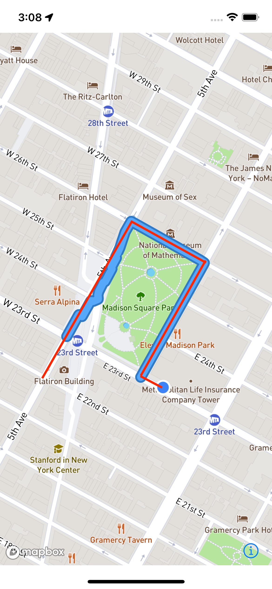
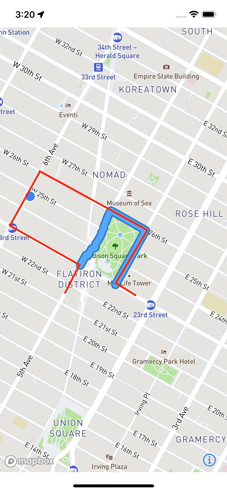
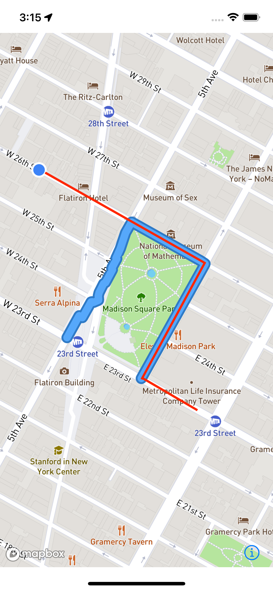

# Mapbox (Re-)Routing Issue

This repository is about our issue using the navigation functionality of Mapbox using the iOS Navigation SDK. It tries to demonstrate different scenarios during a route where the routing is no more working as expected.

## Basic information

### What do we try to achieve?
We have a predefined cycling route and want to use Mapbox to get information like the remaining distance and remaining time of the route.

### How do we try to do do that?

We are using the map matching of Mapbox to get a route from our coordinates of the original route. Afterwards we are creating a new instance of the `NavigationService` for the resuling route. Through the delegate of the service we are getting the information about the progress of the route.

### What is working?

We are getting a route based on our data and if the cyclist is riding from the start to the end without leaving the route, the data about the progress are correct.

### What is not working?

If the rider is leaving the route or joining the route not at the beginning the data are not correct. In some cases the information about being on the route is wrong, in some other cases the information about the remaning time and distance is wrong.

### How can I reproduce it?

- Clone this repository
- Setup your Mapbox tokens (https://docs.mapbox.com/ios/maps/guides/install/)
- Start the app on a simulator or a real device
- Use the included GPX files to simulate the ride of the specific scenario
- See in the logs the information about the route progress (`isOnRoute`, `distanceRemaining`, `durationRemaining`, `fractionTraveled`)

## Scenarios

In the following three example are described and if it's working or not (and what is not working). You can see on each picture the Mapbox route (blue) and the route the GPX file is going along (red).

### 1) Complete

- Status: **Working as expected**
- GPX-File: `complete.gpx`

Along the whole route the status of `isOnRoute` is correct and the information about the progress are constantly decreasing until the cyclist has reached the end of the route.

### 2) Leave and rejoin

- Status: **Not Working as expected**
- GPX-File: `leave_1.gpx`

When leaving the predefined route the SDK is correctly returning `false` for the `isOnRoute`. When returning on the route, `isOnRoute` stays on `false` and the progress information are not updated. **This is not the expected behavior**.

### 3) Join later

- Status: **Not Working as expected**
- GPX-File: `join_later.gpx`

When joining the route `isOnRoute` is getting correctly to true. But the progress information are not updating. When reaching the next corner, the progress information are shortly updating until `isOnRoute` is switching to `false` (although the rider is on the route). **This is not the expected behavior**.

## Implementation details

### Where can I find the relevant implementation?
In this respository the most relevant files are 

- `ContentViewModel.swift` where the map matching and route creation is done
- `MapboxMapView` where the map and route is being shown

### Why don't you use `Directions.shared.calculateRoutes(matching:)`?

Using this function instead of `Directions.shared.calculateRoutes(options:)` is leading to a completely wrong behavior in all scenarios. `userIsOnRoute` is always `true` nevertheless the user is clearly off the route. The progress is not updated at all. We think, that it was broken by the release 2.5.0 (see more in the comment in the `ContentViewModel.swift`). Instead we are creating the `RouteResponse` objects based on the `MapMatchingResponse` by ourself and setting the `options` of the response to `.route()`.
